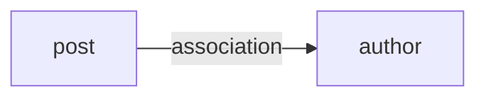

# factory_bot_graph

> [!WARNING]
> This project is experimental. Its behavior, supported syntax, and command-line
> interface may change without notice.

`factory_bot_graph` statically analyzes FactoryBot definitions and renders the
relationships between factories. It helps answer a deceptively hard question:
"What else will be built when I create this factory?"

The parser does not load Rails or evaluate factory definitions. Running it does
not create records or trigger application code.

Ruby 3.3 or later is required.

## Usage

Run the executable from the root of a Rails application:

```sh
bundle exec factory_bot_graph
```

By default, the CLI searches `spec/factories` and `test/factories`. You can
also pass a factory file or directory explicitly.

The default output is a [Mermaid](https://mermaid.js.org/) flowchart:



Paste the result into a Mermaid-compatible Markdown viewer, or generate a
Graphviz DOT file:

```sh
bundle exec factory_bot_graph --format dot > factories.dot
dot -Tsvg factories.dot > factories.svg
```

To focus on everything reachable from one factory:

```sh
bundle exec factory_bot_graph --factory post
```

By default, relationships that only appear when traits are selected are omitted.
To include them:

```sh
bundle exec factory_bot_graph --traits
```

## Detected relationships

- `association :account`
- `association :writer, factory: :author`
- Implicit associations such as `account`, rendered as `association`
- `create`, `create_list`, `build`, `build_list`, `build_stubbed`,
  `attributes_for`, and their list variants
- `association_list`
- Factory inheritance such as `factory :admin, parent: :user`
- Relationships declared inside traits, labeled with the trait name, when
  `--traits` is passed

This is intentionally a static analyzer. Dynamic factory names and associations
hidden inside application helper methods cannot be inferred reliably and are
not shown.

## Development

```sh
ruby -Ilib:test -e 'Dir["test/**/*_test.rb"].sort.each { |file| require File.expand_path(file) }'
```
